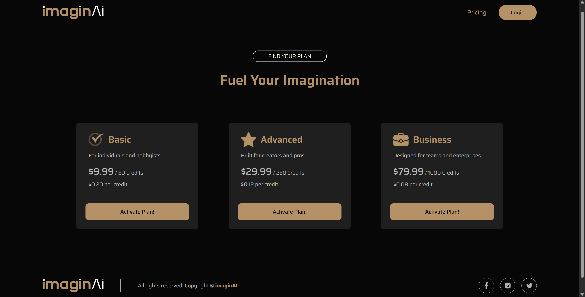
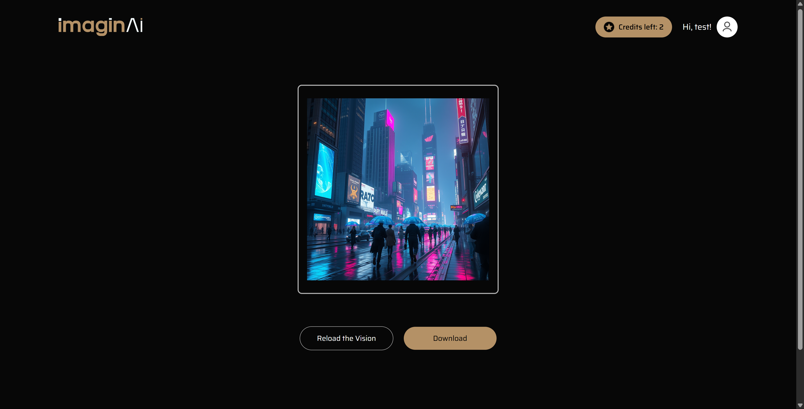

# 🎨🧠 imaginAI — AI-Powered Text-to-Image Generator

imaginAI is a full-stack SaaS web application that lets users generate stunning AI-powered images using text prompts via the ClipDrop API. Users must be logged in and have sufficient credits to generate images from text prompts. Integrated with Razorpay for seamless credit purchases, the app ensures a smooth and intuitive user experience.

---

## 🚀 Features

- 📝 Text-to-Image generation via ClipDrop API
- 🔐 Secure user registration & login system
- 💳 Credit-based generation system (1 image = 1 credit)
- 🎁 5 free credits on signup
- 🧾 Razorpay-powered credit purchase plans
- 📱 Fully responsive UI with smooth animations

---

## 📚 How It Works

1. Users sign up and receive **5 free credits**.
2. Users enter a **descriptive but focused** prompt.
3. 1 credit is deducted and the image is generated via ClipDrop.
4. When credits run out, users must buy a plan.
5. Razorpay integration handles payment; credits are added post-success.

> ⚠️ Prompts must be clear and descriptive, but not overly complex to avoid confusing the AI.

---

## 🛠️ Tech Stack

### 💻 Frontend
- ⚡ **Vite** – Fast development build tool
- ⚛️ **React.js** – Component-based UI
- 🎨 **Tailwind CSS** – Utility-first styling
- 🔀 **React Router** – Client-side routing
- 📡 **Axios** – HTTP client for API requests
- 🎞 **Framer Motion** – Smooth UI animations

### 🔧 Backend
- 🟩 **Node.js** – JavaScript runtime
- 🚂 **Express.js** – Web framework for API development
- 🔐 **JWT** – Authentication using JSON Web Tokens
- 🌐 **CORS** – Enables frontend-backend communication across origins
- 📤 **FormData** – Sends prompts and files to AI image generator APIs

### 🗃️ Database
- **MongoDB** – NoSQL database
- **Mongoose** – Elegant MongoDB ODM

### 🌐 APIs
- **ClipDrop API** – For generating images from prompts
- **Razorpay API** – For handling secure payments

### ☁️ Deployment
- 🚀 Hosted on **Render**

---

## 📦 Installation & Setup

```bash
git clone https://github.com/DarshParikh25/imaginAI.git
cd imaginAI

# Install frontend dependencies
cd frontend
npm install

# Install backend dependencies
cd ../backend
npm install
```

---

## 💾 Environment Setup (.env)

### Create a `.env` file inside the `backend/` directory and add the following keys:

```env
MONGO_URI=your_mongodb_connection_string
JWT_SECRET=your_jwt_secret
RAZORPAY_KEY_ID=your_razorpay_key
RAZORPAY_KEY_SECRET=your_razorpay_secret
CLIPDROP_API_KEY=your_clipdrop_api_key
CURRENCY=your_currency
PORT=you_backend_port
```

### Also, create a `.env` file inside the `frontend/` directory and add the following keys:

> ⚠️ **Environment Variables Note:** \
If you're using **Vite**, all environment variable names must be prefixed with **VITE_**.
If you're using **Create React App (CRA)**, they must be prefixed with **REACT_APP_**. \
These prefixes are required to expose the variables to the frontend code.

```env
VITE_BACKEND_URL=your_backend_url
```


---

## ▶️ Running the Project

### ⬅️ Frontend

```cmd
cd frontend
npm install
npm run dev
```

Runs on `http://localhost:5173`

###  Backend

```cmd
cd backend
npm install
npm run start
```

Runs on `http://localhost:4000` (or the port defined in `.env`)

---

## 📸 Screenshots

### 🏠 Homepage


### 🧾 Credit Plans Page



### 🖼 Image Generation Result



---

## 🛡 License

This project is licensed under the **MIT License**.  
You are free to use, modify, and distribute this software with proper attribution.

See the full license in the [LICENSE](./LICENSE) file.

---

## 👤 Author

**Darsh Parikh**

- 💼 GitHub: [@DarshParikh25](https://github.com/DarshParikh25)
- 🔗 LinkedIn: [darshparikh](https://www.linkedin.com/in/darsh-parikh-66538a251)
- 📫 Email: darshparikh00@gmail.com 

---

## 📬 Feedback

Have suggestions or questions? \
Feel free to open an issue.

> Made with ❤️ by **Darsh Parikh**